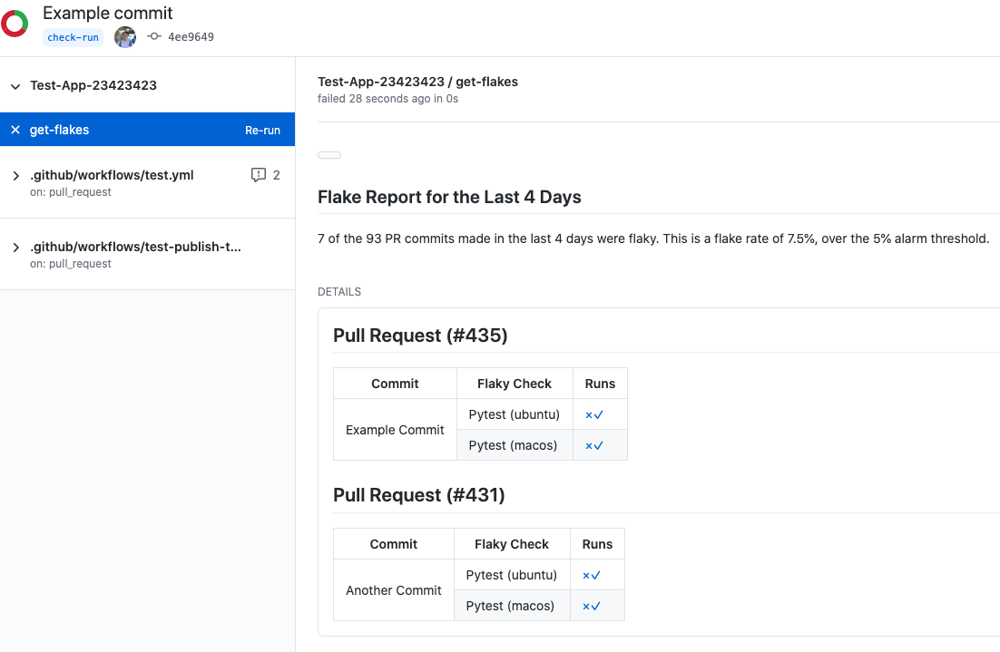

# get-flakes 🍦

**under construction, do not attempt to use.**

**A CI tool that finds flaky GitHub Actions checks on recent pull requests**

---

get-flakes lets you automatically alert the team when flaky tests are hurting productivity.

It does this by querying your GitHub repo's recent check runs for GitHub Actions activity. When an action has been restarted and gives a different result, get-flakes marks this as flaky.

Excessive test retrying slows delivery, wastes resources, and hides real bugs.

## Quickstart

Create this file in your repo so you can manually trigger get-flakes and have it run periodically.

If more than 5% of commits in pull requests exhibit flakiness then the check fails.

```yaml
# .github/workflows/get-flakes.yml
on:
  workflow_dispatch:
    inputs:
      tags:
        description: 'Run get-flakes'
  schedule:
    - cron: 0 0 * * */7
jobs:
  get-flakes:
    runs-on: ubuntu-latest
    steps:
      - uses: actions/setup-python@v2
      - run: pip install get-flakes
      - run: |
          get-flakes \
            --days 8 \
            --alarm-threshold=.05
            --token='${{ secrets.GITHUB_TOKEN }}'
```

This will write a markdown report which can be published back to GitHub:

<p align="center">
  
</p>


## Use outisde of GitHub Actions


Ensure you have Python 3 setup before you start

Install the Python package

```sh
pip install get-flakes
```

```sh
get-flakes report \
--days=9 \
--github_token=<...> \
--repo=treebeardtech/get-flakes \
--check_sha=<...> # The commit where the report goes, default is HEAD commit
```


## Contribute to this Design

This project is not yet ready for consumption but is available for ideation/feedback.

Feature requests and feedback welcome via email and issues.
